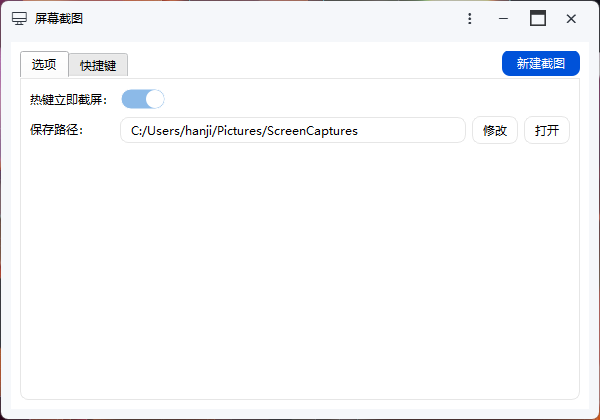

一款屏幕截图工具，支持选区、标注、贴图等功能。

## 选区与标注功能

开始截图后，可以通过鼠标拖拽来旋转截图区域。选好区域后，通过下册操作区可以选择操作，功能区按钮从左到右依次是：矩形标注、椭圆标注、自由线段标注、取消、贴图、保存并关闭、复制并关闭

## 截图配置

工具提供了一些配置项：

- 热键立即截屏：启用该选项后，如果通过全局热键启动该工具，那么将直接进入截图，而不会显示该配置界面
- 保存路径：保存截图的默认路径

**提示**：启用`后台运行`，关闭窗口后可继续使用截图、贴图功能

## 快捷键配置

提供了一些工具内快捷键：

- 截图：这些快捷键仅在截图过程中有效
- 贴图：这些快捷键仅对贴图有效

