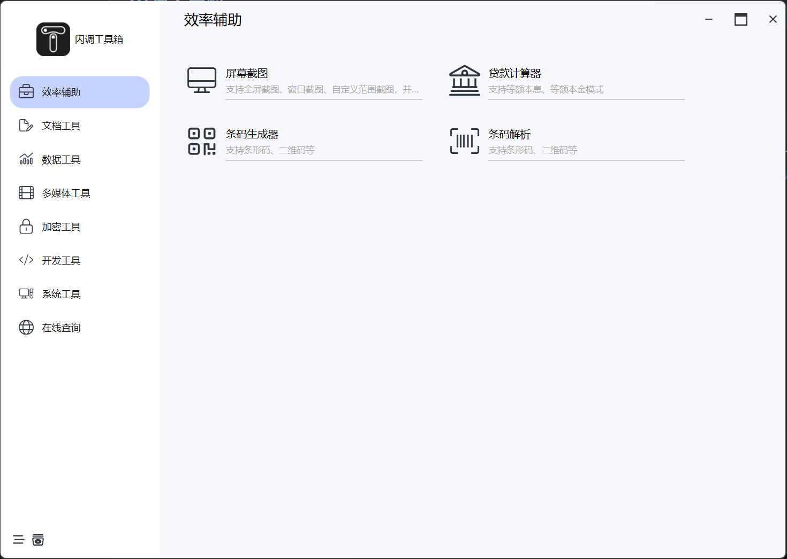
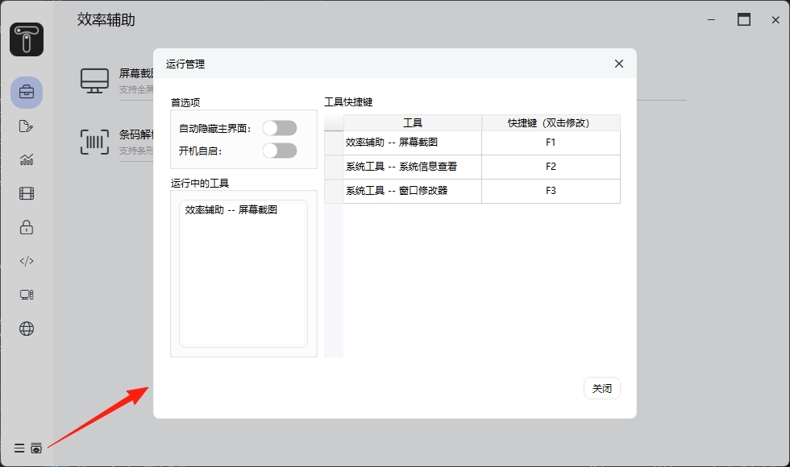

闪调工具箱是一款轻量级的软件集合，具有功能丰富、运行流畅、数据安全等特点。软件正处于起步阶段，可能存在BUG，请慎重使用。

## 主界面

主界面分主要分为左侧工具分类导航和右侧工具列表两个部分，鼠标单击工具列表即可打开工具。

## 运行管理

运行管理界面是唯一的全局设置界面，负责全局配置与管理。具体工具的配置需要在对应工具内进行。下面对管理界面进行简单说明：

* 运行中的工具：为正在运行（包括后台运行）的工具，提供对工具运行情况的总览。在列表上右键，可以对正在运行的工具进行操作，比如关闭工具。
* 工具快捷键：提供通过快捷键启动工具的方式。右键弹出菜单可以增加或删除快捷键；双击`快捷键`列可以对工具绑定的快捷键进行修改。

## 工具通用操作

为了尽可能简化工具的配置与使用，设计了工具的通用设置方式，下面以截图工具举例：

* 工具菜单：点击右上角三个点，会弹出通用设置项目，包括：
  * 置顶窗口：窗口显示保持在最上层
  * 后台运行：窗口关闭后不退出当前工具，比如在使用贴图功能时，可以勾选此项达到关闭窗口贴图仍可用的目的
  * 其他：根据软件的规划，还可能有其他通用操作
* 快捷方式入口：例如截图工具，想通过快捷键直接截图，这时候就可以启用`热键立即截屏`开关，这样通过快捷键启动时就会立即截图而不会打开工具界面。
  * 说明：仅在有立即启动的工具提供该选项

## 问题反馈渠道

目前，使用Github Issues进行功能与问题跟踪，请前往[Github](https://github.com/Lanchitour/LCToolbox-Feedback/issues)进行反馈。